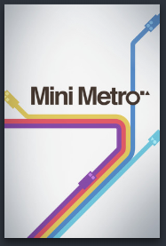

# Steam Artworks

A collection of various artwork covers for the Steam Library.
 
## What are Steam Artwork Covers?

Steam artwork covers are these things:

You'll find the covers when you click on this:

## How to use these Artwork Covers?

It's simple.

Just download the newest release and unzip all the files. Then open Steam. In Steam: Library > HOME (upper left corner) > Right Click on any Cover (If you can't see a Cover, you have to add a new Shelf) > Manage > Set Custom Artwork. Then you have to select the downloaded files. That's it.

## How can I help?

### 1. Errors

You can search for errors. If you find an error, you can create a pull request.

### 2. Suggestions

You can submit your suggestions [here](https://docs.google.com/forms/d/e/1FAIpQLSfeTlHdRuyFv8XdTM7DqoEVf2ZNFUiGyufvpNP5CqdeeqnAbQ/viewform?usp=sf_link).

## How can I contact You?

- [Twitter](https://twitter.com/Reecer_TV)
- Discord: ReecerTV#5535