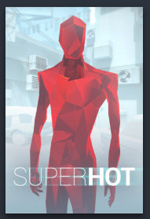

# Steam Artworks

A collection of various artwork covers for the Steam Library.
 
## What are Steam Artwork Covers?

Steam artwork covers are these things:

You'll find the covers when you click on this:

(I know, i can't paint 😀)

## How to use these Artwork Covers?

It's simple.

Just download the newest release and extract all files. Then open Steam 